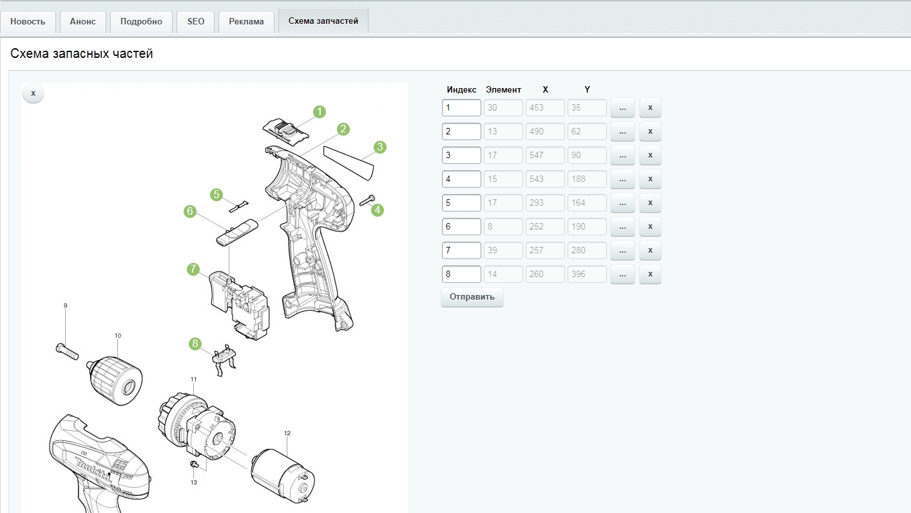
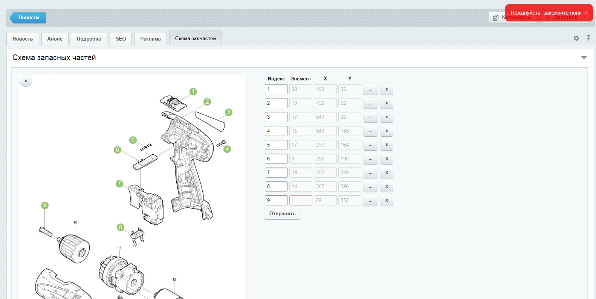
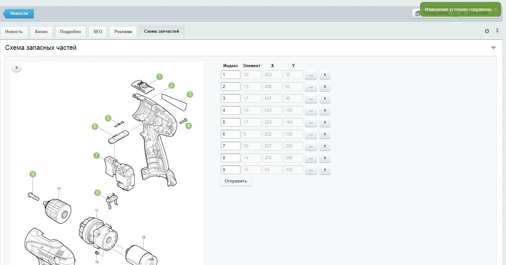
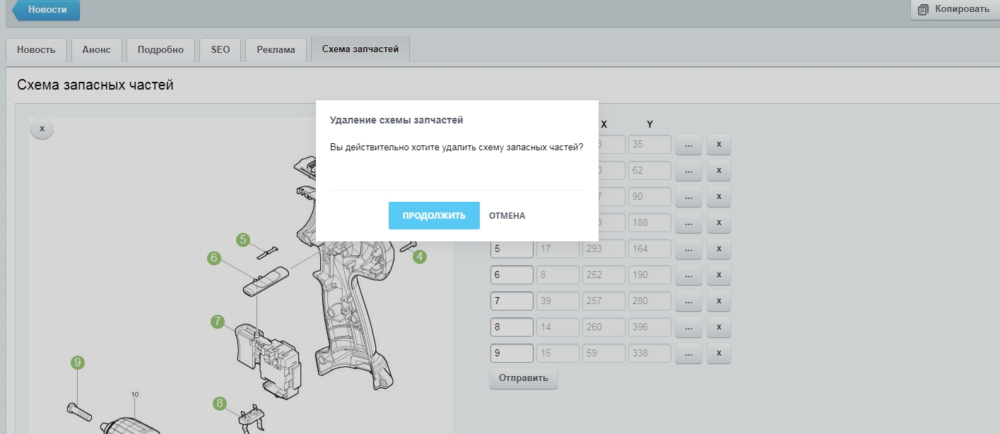
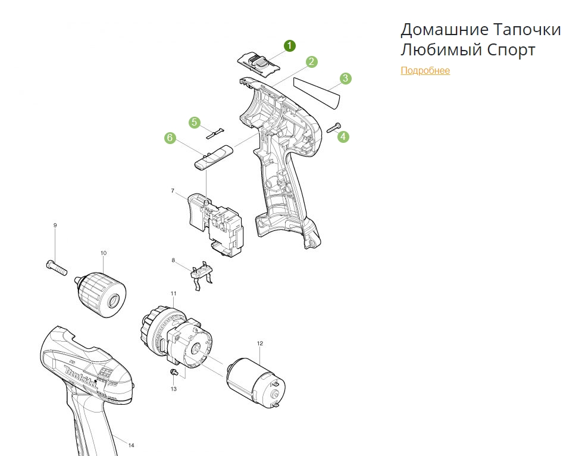

# bitrix_spare_parts
Модуль "Запасные части" для товаров

Модуль позволяет добавлять в нужный инфоблок схему с запасными частями товаров.

При клике на схему в месте клика появляется кружок с порядковым номером, а справа от схемы в одном ряду с другими появляется поле для привязки элемента запасной части. При попытке сохранить данные с незаполненным подсвеченным полем, появится сообщение об ошибке.

При успешном сохранении данных появится соответствующее сообщение.

Удалить данные для элемента инфоблока можно, кликнув на крестик в левом верхнем углу изображения схемы.

Вывести данные можно при помощи компонента polus:spare.parts. При клике на кружок с порядковым номером появится описание соответствующей запасной части и ссылка на ее детальную страницу.

